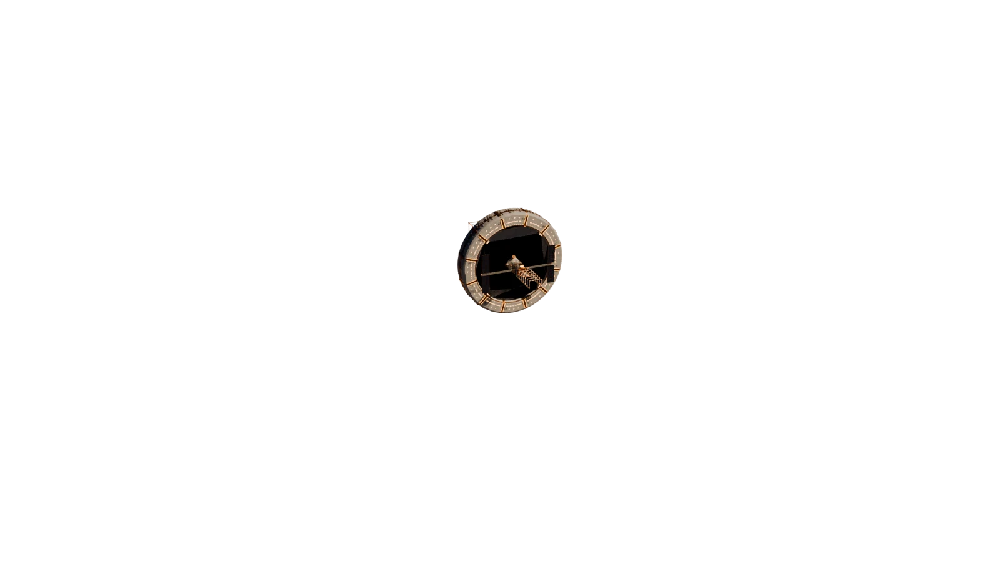

# Kepler-9, station orbitale

Une station imaginée autour de Kepler-9 b, une géante gazeuse qui existe vraiment, à 2 050 années-lumière. On la visite au scroll, en dix haltes : on arrive de loin, on traverse les anneaux, on longe la station et on finit au lever du soleil.



**Démo** : https://kepler-9-station.vercel.app

## Ce qu'il y a dedans

- Une scène three.js unique, pilotée par le scroll avec GSAP.
- Une station modélisée avec Blender en ligne de commande, exportée en glTF.
- Un éclairage précalculé (occlusion ambiante et lumière indirecte) chargé en textures légères.
- Une version texte complète pour les lecteurs d'écran et les connexions lentes.
- Des tests navigateur (Playwright) qui vérifient le scroll, la fluidité et la caméra.

## Stack

three.js, postprocessing, GSAP, Vite. Polices Big Shoulders et Newsreader auto-hébergées.

## Lancer

```sh
npm ci
npm run dev      # http://127.0.0.1:4341
npm run build
npm run preview
```

## Comment il a été fait

Je l'ai conçu et dirigé ; une bonne partie du code et des modèles a été produite par des agents IA (Claude Code, Codex) sur mon serveur, avec des tests à chaque étape.
